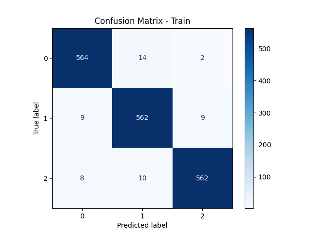

# sEMG Hand Movement Classification

This repository contains code for training **Random Forest (RF), Support Vector Machines (SVM), and Multi-Layer Perceptron (MLP)** models for hand movement classification using **surface electromyography (sEMG) data**.

---

## Setup and Installation

### 1. Create a Virtual Environment
First, create and activate a Python virtual environment:

```bash
python -m venv env
source env/bin/activate  # For Linux/Mac
env\Scripts\activate  # For Windows
```

### 2. Install Dependencies
Ensure you have all required packages installed by running:

```bash
pip install -r requirements.txt
```

---

## Training the Models

### Train the MLP Model

To train the **Multi-Layer Perceptron (MLP)** model, run:

```bash
python src/mlp.py
```

#### MLP Model Details
- Fully connected **feedforward network** with multiple hidden layers.
- Batch normalization and **Leaky ReLU activation** improve training stability.
- **Dropout** is used to reduce overfitting.
- Optimized using the **Adam optimizer** with cross-entropy loss.
- **GPU support** for accelerated training.

#### Configuration
- Hidden layer structures: `[128, 128, 128, 64, 32, 16]`, `[32, 16]`, `[64, 32, 32]`, etc.
- Dropout rates: `0.3`, `0.5`
- Learning rate: `0.001`
- Loss function: `CrossEntropyLoss`
- Early stopping prevents unnecessary training.

---

### Train the SVM Model

To train the **Support Vector Machine (SVM)** model, run:

```bash
python src/svm.py
```

#### SVM Model Details
- Uses **Radial Basis Function (RBF) kernel** for non-linear classification.
- Optionally applies **PCA for dimensionality reduction**.
- Hyperparameters **C** and **gamma** tuned using cross-validation.
- Training time is significantly shorter than MLP.

#### Configuration
- Window sizes: `4000` (ms)
- PCA Components: `no_pca`, `25`, `30`, `35`, `40`
- Kernel: `rbf`
- Regularization parameter (C): `[20, 10, 1, 0.5, 0.1]`
- Gamma values: `scale`
- Evaluation Metrics: `Accuracy`, `F1-score`

---

### Train the Random Forest Model

To train the **Random Forest (RF)** model, run:

```bash
python src/random_forest.py
```

#### RF Model Details
- Ensemble-based decision trees, reducing variance and improving generalization.
- Uses **bootstrap sampling** to train diverse trees.
- Grid search over hyperparameters:
  - `n_estimators`: Number of trees in the forest.
  - `max_depth`: Controls tree growth and overfitting.
  - `min_samples_split`: Minimum samples needed to split a node.
  - `max_features`: Features considered for best split (`sqrt`, `log2`).

#### Configuration
- Window sizes: `300ms`
- Estimators: `[5, 10, 15]`
- Min samples split: `[0.05, 0.1, 0.15, 0.2]`
- Max depth: `[3, 4, 5, 6, 7, 8, 9, 10]`
- Feature selection methods: `sqrt`, `log2`

---

## Inference and Evaluation

### Running Inference on a Test Subject

To perform inference on a test subject, run:

```bash
python src/inference.py --model <path_to_model> --test_data <path_to_test_file>
```

#### Model Options:
- **SVM:** Uses `SVC.predict_proba()` for probability-based classification.
- **Random Forest:** Uses `predict_proba()` to obtain class probabilities.
- **MLP:** Uses a PyTorch model with `Softmax` for probability estimation.

#### Configuration Parameters:
- **Window size:** `1200ms`
- **Sequence aggregation:** Sliding window (`N=3`) or block-based grouping.
- **Feature standardization:** Uses mean and standard deviation from the training set.
- **PCA:** Can be applied before inference if configured.

### Output:
- **Classification Report:** A `.txt` file containing precision, recall, and F1-score.
- **Confusion Matrix:** A `.png` file visualizing classification performance.
- **Predicted Labels:** Stored for further analysis.

Example output:
```
Classification Report:
               precision    recall  f1-score   support
           0     0.72      0.65      0.68        50
           1     0.78      0.83      0.80        50
           2     0.85      0.90      0.87        50
    accuracy                         0.79       150
```



---

## Model Evaluation and Results

### Saving the Best Model
Each model automatically **saves the best-performing version** based on **validation F1-score**.

- **MLP Best Model Path:** `models/best_mlp_<config>.pth`
- **SVM Best Model Path:** `models/SVC/best_svc_<window>.pkl`
- **RF Best Model Path:** `models/RF/best_rf_<window>.pkl`
---
